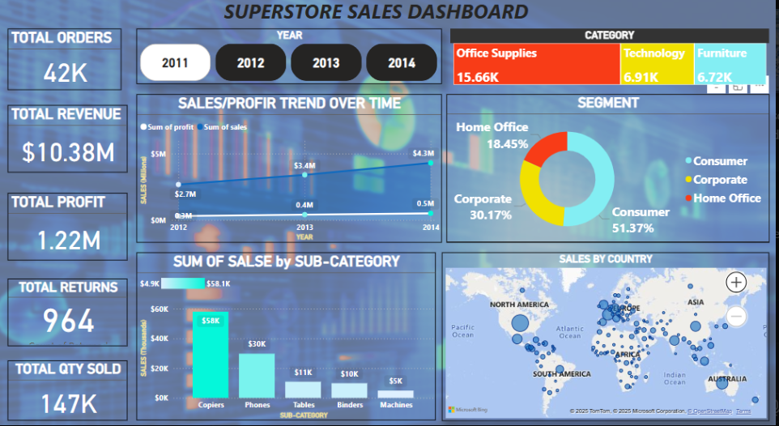

# 📈 Superstore Sales Dashboard – Power BI Project

This Power BI dashboard provides insights into regional sales performance, customer segments, product categories, and overall sales trends for a retail superstore.

---

## 🧾 Overview

- **Total Orders**: 42,000+  
- **Total Revenue**: $10.38M  
- **Total Profit**: $1.22M  
- **Total Returns**: 964  
- **Total Quantity Sold**: 147K items  

---

## 📊 Key Performance Insights

### ✅ Category-Wise Sales
- **Top Category**: Office Supplies (15.66K sales)
- Technology and Furniture follow with 6.91K and 6.72K sales respectively.

### ✅ Sales by Segment
- **Consumer Segment** dominates with 51.37%
- Corporate: 30.17%
- Home Office: 18.45%

### ✅ Sales & Profit Trend Over Time
- Sales increased from **$2.7M in 2012** to **$4.3M in 2014**
- Profit remains consistent but significantly lower than sales, indicating possible margin challenges

### ✅ Top Sub-Categories by Sales
- **Copiers** lead with $58K in revenue
- Followed by Phones ($30K), Tables, and Binders

### ✅ Geographic Sales Distribution
- Dense sales clusters observed in **North America**, **Europe**, and parts of **Asia**
- Global presence indicated across continents

---

## 💡 Business Recommendations

- Focus marketing efforts on **Office Supplies**, especially **Copiers**
- Explore upselling in **Furniture** and **Technology** to increase per-order profit
- Investigate **return reasons** to reduce the 964 returns and improve net margin
- Monitor **regional performance** for inventory optimization

---

